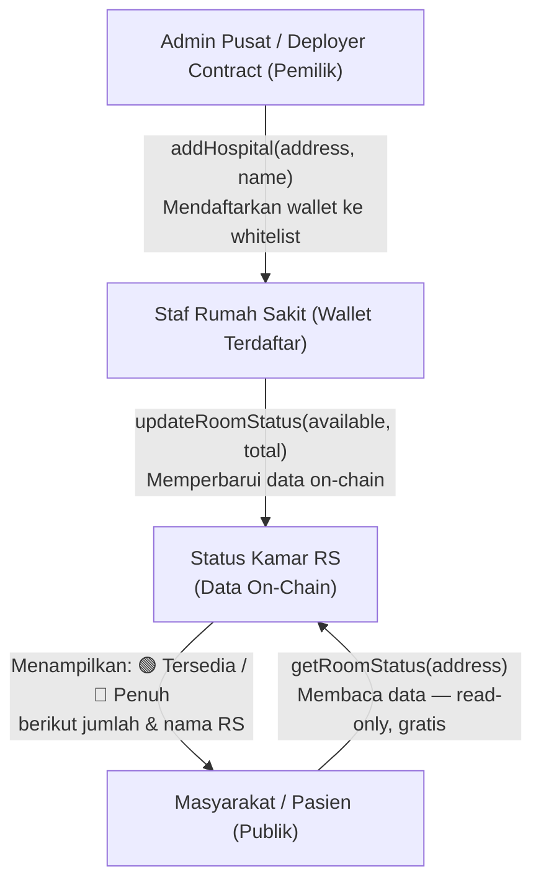

# 🏥 Capstone Project: DApp Ketersediaan Kamar Rumah Sakit Terdesentralisasi
**Solidity ^0.8.20 | Hardhat | Ethers.js v6 | React + Tailwind CSS**

---

## 📐 Arsitektur Sistem



---

## 🔑 Komponen Teknis Utama

| Fitur | Implementasi | File |
|-------|-------------|------|
| Integritas Data | `struct RoomInfo` + `mapping(address => RoomInfo)` | HospitalRoom.sol |
| Kontrol Akses | `Ownable` (owner) + modifier `onlyRegisteredHospital` | HospitalRoom.sol |
| Pencegahan Sybil Attack | Tidak ada self-register — hanya `addHospital()` oleh owner | HospitalRoom.sol |
| Pembaruan Trustless | `updateRoomStatus()` langsung menulis on-chain tanpa perantara | HospitalRoom.sol |
| Transparansi Publik | Fungsi `view` terbuka — tidak memerlukan wallet atau gas | HospitalRoom.sol |
| Audit Trail | Setiap aksi penting memancarkan `event` on-chain | HospitalRoom.sol |

---

## 🧠 Penjelasan Alur Logika Fungsi Utama

### 1. `addHospital(address, name)` — Khusus Owner (Admin Pusat)
> Satu-satunya cara untuk mendaftarkan wallet rumah sakit. Tidak ada self-registration. Mencegah Sybil Attack secara struktural.

```
Admin Pusat memanggil addHospital(0xStafRS, "RS Maju Sehat")
    → Modifier onlyOwner: require(msg.sender == owner) ✓
    → Validasi: address tidak nol, nama tidak kosong, belum terdaftar
    → hospitalData[0xStafRS] = RoomInfo{ name, totalRooms: 0, availableRooms: 0, isRegistered: true }
    → hospitalList.push(0xStafRS)
    → emit HospitalAdded(0xStafRS, "RS Maju Sehat")
```

### 2. `removeHospital(address)` — Khusus Owner (Admin Pusat)
> Mencabut akses wallet rumah sakit. Data historis tetap tersimpan on-chain untuk transparansi — hanya flag `isRegistered` yang diubah.

```
Admin Pusat memanggil removeHospital(0xStafRS)
    → Modifier onlyOwner ✓
    → Validasi: hospitalData[0xStafRS].isRegistered == true ✓
    → hospitalData[0xStafRS].isRegistered = false   ← Akses dicabut
    → emit HospitalRemoved(0xStafRS)                ← Audit trail tetap ada
```

### 3. `updateRoomStatus(available, total)` — Trustless Automation ⚡
> Staf RS yang wallet-nya sudah di-whitelist memperbarui data kamar secara langsung on-chain. Tidak ada perantara, tidak bisa dimanipulasi.

```
Staf RS (0xStafRS) memanggil updateRoomStatus(15, 30)
    → Modifier onlyRegisteredHospital: hospitalData[msg.sender].isRegistered == true ✓
    → Validasi: 15 <= 30 ✓ dan 30 > 0 ✓
    → info.availableRooms = 15
    → info.totalRooms     = 30
    → info.lastUpdated    = block.timestamp          ← Dicatat otomatis
    → emit RoomStatusUpdated(0xStafRS, 15, 30, timestamp)
```

### 4. `getRoomStatus(address)` — Publik, Tanpa Gas untuk Pemanggil
> Siapa pun — termasuk pasien tanpa wallet — dapat membaca data secara real-time langsung dari blockchain.

```
Pasien memanggil getRoomStatus(0xStafRS)
    → Fungsi view, tidak ada transaksi, tidak ada gas
    → Mengembalikan: (name, totalRooms, availableRooms, isRegistered, lastUpdated, isFull)
    → isFull = (availableRooms == 0)   ← Dihitung otomatis on-chain
    → Contoh: ("RS Maju Sehat", 30, 15, true, 1712900000, false)
```

### 5. `getAllHospitals()` + `totalHospitals()` — Publik
> Digunakan oleh frontend dashboard untuk menampilkan semua RS terdaftar secara dinamis.

```
getAllHospitals()   → address[] semua wallet RS yang pernah terdaftar
totalHospitals()   → uint256 jumlah total RS dalam sistem
```

---

## 🚀 Langkah Menjalankan Proyek (Hardhat Local Node)

### Step 1 — Kompilasi Smart Contract
```bash
cd C:\Users\Windows\sct\hospital-dapp
npx hardhat compile
```
✅ Hasil yang diharapkan: `Compiled 1 Solidity file successfully`

### Step 2 — Jalankan Local Blockchain Node
```bash
# Biarkan terminal ini tetap terbuka sepanjang sesi pengembangan
npx hardhat node
```
✅ Akan menampilkan 20 akun uji coba beserta private key-nya.

### Step 3 — Deploy Smart Contract
```bash
# Buka terminal baru
npx hardhat run scripts/deploy.js --network localhost
```
✅ Hasil yang diharapkan:
```
HospitalRoom deployed to: 0x5FbDB2315678afecb367f032d93F642f64180aa3
Test hospital registered: 0x70997970C51812dc3A010C7d01b50e0d17dc7944
```

### Step 4 — Salin Contract Address ke Frontend
Salin nilai `CONTRACT_ADDRESS` yang tercetak ke file konfigurasi frontend.

### Step 5 — Urutan Pengujian Fungsional

```
Gunakan Hardhat Console: npx hardhat console --network localhost

1. [Owner]      addHospital(0xAccount1, "RS Maju Sehat")
2. [Staf RS]    updateRoomStatus(15, 30)         ← availableRooms=15, totalRooms=30
3. [Publik]     getRoomStatus(0xAccount1)        ← Tampilkan status: Tersedia (15/30)
4. [Staf RS]    updateRoomStatus(0, 30)          ← Semua kamar terisi
5. [Publik]     getRoomStatus(0xAccount1)        ← Tampilkan status: Penuh (0/30)
6. [Penyerang]  updateRoomStatus(5, 10)          ← REVERT: bukan RS terdaftar ❌
7. [Penyerang]  addHospital(0xFake, "RS Palsu")  ← REVERT: bukan owner ❌
```

> [!TIP]
> Gunakan Account[0] sebagai Owner (Admin Pusat), Account[1] sebagai Staf RS terdaftar, dan Account[2] sebagai Penyerang untuk mensimulasikan skenario Sybil Attack yang diblokir.

---

## 🛡️ Security Checklist

- [x] **Anti-Sybil Attack** — Tidak ada self-register; hanya owner yang bisa whitelist wallet RS
- [x] **Ownable Pattern** — Owner (deployer) terpisah jelas dari entitas operasional
- [x] **Kontrol Akses Berlapis** — `onlyOwner` untuk manajemen RS, `onlyRegisteredHospital` untuk update data
- [x] **Validasi Input** — Semua fungsi dilindungi oleh `require` guard yang spesifik
- [x] **Data Imutabel** — Data historis tetap on-chain meskipun akses RS dicabut
- [x] **Reentrancy Safe** — Tidak ada transfer ETH atau callback eksternal
- [x] **Audit Trail Lengkap** — Semua aksi kritis (tambah RS, cabut RS, update kamar) dipancarkan sebagai `event`

---

## 📁 File Referensi

- [HospitalRoom.sol](file:///C:/Users/Windows/sct/hospital-dapp/contracts/HospitalRoom.sol)
- [deploy.js](file:///C:/Users/Windows/sct/hospital-dapp/scripts/deploy.js)
- [hardhat.config.js](file:///C:/Users/Windows/sct/hospital-dapp/hardhat.config.js)
