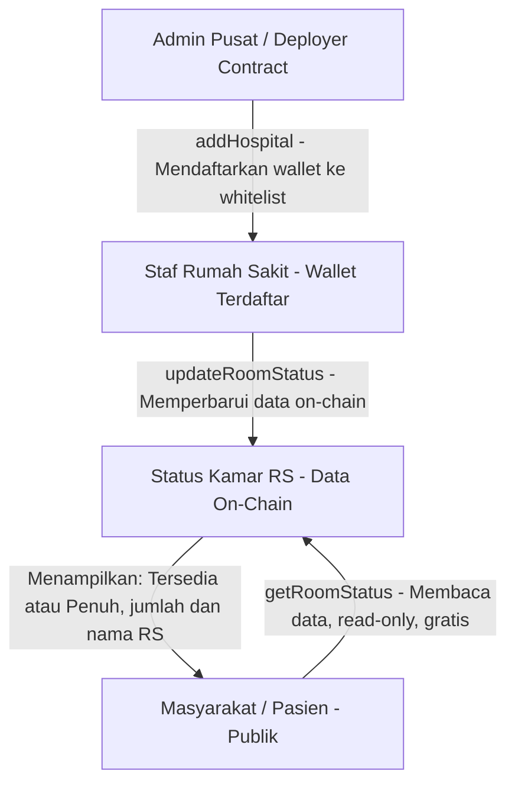
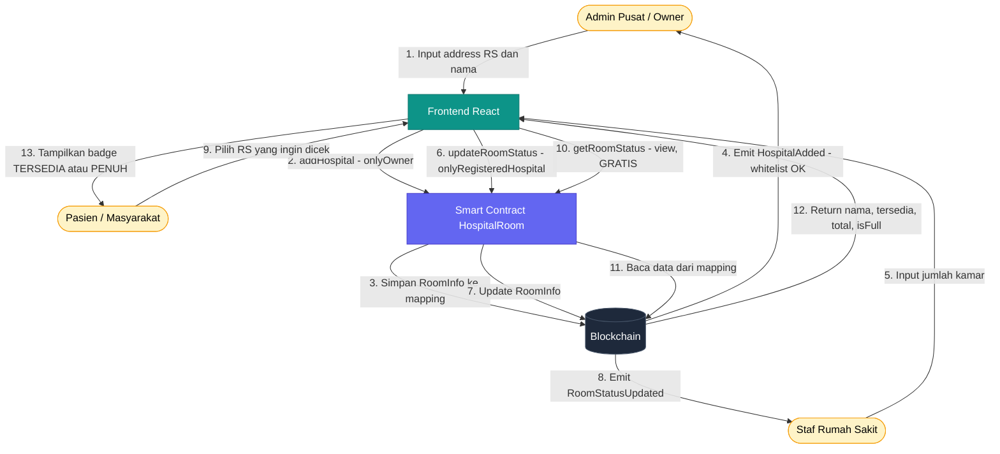
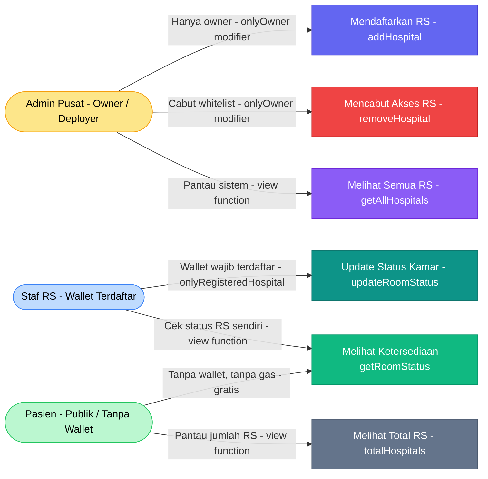

# 🏥 Capstone Project: DApp Ketersediaan Kamar Rumah Sakit Terdesentralisasi
**Solidity ^0.8.20 | Hardhat | Ethers.js v6 | React + Tailwind CSS**

---

## 📐 Arsitektur Sistem



---

## 🔑 Komponen Teknis Utama

| Fitur | Implementasi | File |
|-------|-------------|------|
| Integritas Data | `struct RoomInfo` + `mapping(address => RoomInfo)` | HospitalRoom.sol |
| Kontrol Akses | `Ownable` (owner) + modifier `onlyRegisteredHospital` | HospitalRoom.sol |
| Pencegahan Sybil Attack | Tidak ada self-register — hanya `addHospital()` oleh owner | HospitalRoom.sol |
| Pembaruan Trustless | `updateRoomStatus()` langsung menulis on-chain tanpa perantara | HospitalRoom.sol |
| Transparansi Publik | Fungsi `view` terbuka — tidak memerlukan wallet atau gas | HospitalRoom.sol |
| Audit Trail | Setiap aksi penting memancarkan `event` on-chain | HospitalRoom.sol |

---

## 🧠 Penjelasan Alur Logika Fungsi Utama

### 1. `addHospital(address, name)` — Khusus Owner (Admin Pusat)
> Satu-satunya cara untuk mendaftarkan wallet rumah sakit. Tidak ada self-registration. Mencegah Sybil Attack secara struktural.

```
Admin Pusat memanggil addHospital(0xStafRS, "RS Maju Sehat")
    → Modifier onlyOwner: require(msg.sender == owner) ✓
    → Validasi: address tidak nol, nama tidak kosong, belum terdaftar
    → hospitalData[0xStafRS] = RoomInfo{ name, totalRooms: 0, availableRooms: 0, isRegistered: true }
    → hospitalList.push(0xStafRS)
    → emit HospitalAdded(0xStafRS, "RS Maju Sehat")
```

### 2. `removeHospital(address)` — Khusus Owner (Admin Pusat)
> Mencabut akses wallet rumah sakit. Data historis tetap tersimpan on-chain untuk transparansi — hanya flag `isRegistered` yang diubah.

```
Admin Pusat memanggil removeHospital(0xStafRS)
    → Modifier onlyOwner ✓
    → Validasi: hospitalData[0xStafRS].isRegistered == true ✓
    → hospitalData[0xStafRS].isRegistered = false   ← Akses dicabut
    → emit HospitalRemoved(0xStafRS)                ← Audit trail tetap ada
```

### 3. `updateRoomStatus(available, total)` — Trustless Automation ⚡
> Staf RS yang wallet-nya sudah di-whitelist memperbarui data kamar secara langsung on-chain. Tidak ada perantara, tidak bisa dimanipulasi.

```
Staf RS (0xStafRS) memanggil updateRoomStatus(15, 30)
    → Modifier onlyRegisteredHospital: hospitalData[msg.sender].isRegistered == true ✓
    → Validasi: 15 <= 30 ✓ dan 30 > 0 ✓
    → info.availableRooms = 15
    → info.totalRooms     = 30
    → info.lastUpdated    = block.timestamp          ← Dicatat otomatis
    → emit RoomStatusUpdated(0xStafRS, 15, 30, timestamp)
```

### 4. `getRoomStatus(address)` — Publik, Tanpa Gas untuk Pemanggil
> Siapa pun — termasuk pasien tanpa wallet — dapat membaca data secara real-time langsung dari blockchain.

```
Pasien memanggil getRoomStatus(0xStafRS)
    → Fungsi view, tidak ada transaksi, tidak ada gas
    → Mengembalikan: (name, totalRooms, availableRooms, isRegistered, lastUpdated, isFull)
    → isFull = (availableRooms == 0)   ← Dihitung otomatis on-chain
    → Contoh: ("RS Maju Sehat", 30, 15, true, 1712900000, false)
```

### 5. `getAllHospitals()` + `totalHospitals()` — Publik
> Digunakan oleh frontend dashboard untuk menampilkan semua RS terdaftar secara dinamis.

```
getAllHospitals()   → address[] semua wallet RS yang pernah terdaftar
totalHospitals()   → uint256 jumlah total RS dalam sistem
```

---

## 🚀 Langkah Menjalankan Proyek (Hardhat Local Node)

### Step 1 — Kompilasi Smart Contract
```bash
cd C:\Users\Windows\sct\hospital-dapp
npx hardhat compile
```
✅ Hasil yang diharapkan: `Compiled 1 Solidity file successfully`

### Step 2 — Jalankan Local Blockchain Node
```bash
# Biarkan terminal ini tetap terbuka sepanjang sesi pengembangan
npx hardhat node
```
✅ Akan menampilkan 20 akun uji coba beserta private key-nya.

### Step 3 — Deploy Smart Contract
```bash
# Buka terminal baru
npx hardhat run scripts/deploy.js --network localhost
```
✅ Hasil yang diharapkan:
```
HospitalRoom deployed to: 0x5FbDB2315678afecb367f032d93F642f64180aa3
Test hospital registered: 0x70997970C51812dc3A010C7d01b50e0d17dc7944
```

### Step 4 — Salin Contract Address ke Frontend
Salin nilai `CONTRACT_ADDRESS` yang tercetak ke file konfigurasi frontend.

### Step 5 — Urutan Pengujian Fungsional

```
Gunakan Hardhat Console: npx hardhat console --network localhost

1. [Owner]      addHospital(0xAccount1, "RS Maju Sehat")
2. [Staf RS]    updateRoomStatus(15, 30)         ← availableRooms=15, totalRooms=30
3. [Publik]     getRoomStatus(0xAccount1)        ← Tampilkan status: Tersedia (15/30)
4. [Staf RS]    updateRoomStatus(0, 30)          ← Semua kamar terisi
5. [Publik]     getRoomStatus(0xAccount1)        ← Tampilkan status: Penuh (0/30)
6. [Penyerang]  updateRoomStatus(5, 10)          ← REVERT: bukan RS terdaftar ❌
7. [Penyerang]  addHospital(0xFake, "RS Palsu")  ← REVERT: bukan owner ❌
```

> [!TIP]
> Gunakan Account[0] sebagai Owner (Admin Pusat), Account[1] sebagai Staf RS terdaftar, dan Account[2] sebagai Penyerang untuk mensimulasikan skenario Sybil Attack yang diblokir.

---

## 🛡️ Security Checklist

- [x] **Anti-Sybil Attack** — Tidak ada self-register; hanya owner yang bisa whitelist wallet RS
- [x] **Ownable Pattern** — Owner (deployer) terpisah jelas dari entitas operasional
- [x] **Kontrol Akses Berlapis** — `onlyOwner` untuk manajemen RS, `onlyRegisteredHospital` untuk update data
- [x] **Validasi Input** — Semua fungsi dilindungi oleh `require` guard yang spesifik
- [x] **Data Imutabel** — Data historis tetap on-chain meskipun akses RS dicabut
- [x] **Reentrancy Safe** — Tidak ada transfer ETH atau callback eksternal
- [x] **Audit Trail Lengkap** — Semua aksi kritis (tambah RS, cabut RS, update kamar) dipancarkan sebagai `event`

---

- [HospitalRoom.sol](../contracts/HospitalRoom.sol)
- [deploy.js](../scripts/deploy.js)
- [hardhat.config.js](../hardhat.config.js)

---

## 🗺️ Dokumentasi Arsitektur Sistem

### Diagram Alir: Input → Proses → Output



---

### Tabel Cara Kerja Program — Berdasarkan Peran

#### 👥 Peran: PUBLIK (Pasien / Masyarakat)

| Langkah | Aktor | Aksi | Layer | Fungsi Kontrak | Output |
|--------:|-------|------|-------|---------------|--------|
| 1 | Pasien | Membuka `localhost:5173` di browser | Frontend | — | Halaman Dashboard Publik tampil |
| 2 | Pasien | Melihat daftar RS terdaftar secara otomatis | Frontend → SC | `getAllHospitals()` | Tombol address RS muncul |
| 3 | Pasien | Klik tombol address RS **atau** ketik address manual | Frontend | — | Input address terisi |
| 4 | Pasien | Klik tombol **🔍 Cari** | Frontend | — | Request dikirim ke blockchain |
| 5 | — | Frontend memanggil kontrak (read-only, tanpa wallet) | Ethers.js → SC | `getRoomStatus(address)` | Data kamar dikembalikan |
| 6 | — | Smart contract membaca `RoomInfo` dari `mapping` | Blockchain | — | Return: nama, tersedia, total, isFull |
| 7 | Pasien | Melihat kartu status kamar | Frontend | — | Badge **🟢 TERSEDIA** atau **🔴 PENUH** |
| 8 | — | Dashboard auto-refresh setiap 15 detik | Frontend | `getRoomStatus()` | Data selalu terkini tanpa reload manual |

> **Biaya:** Rp 0 / $0 — fungsi `view` tidak memerlukan gas. Tidak perlu wallet, tidak perlu akun.

---

#### 🔑 Peran: ADMIN PUSAT (Owner / Deployer Contract)

| Langkah | Aktor | Aksi | Layer | Fungsi Kontrak | Output |
|--------:|-------|------|-------|---------------|--------|
| 1 | Admin Pusat | Buka Hardhat Console atau Panel Admin | Terminal / Frontend | — | Koneksi ke node lokal |
| 2 | Admin Pusat | Siapkan address wallet RS yang akan didaftarkan | — | — | Address: `0xWalletRS` |
| 3 | Admin Pusat | Panggil `addHospital(address, name)` | Hardhat Console / SC | `addHospital()` | Transaksi dikirim ke blockchain |
| 4 | — | Modifier `onlyOwner` memverifikasi caller | Smart Contract | `require(msg.sender == owner)` | Lulus ✅ atau Revert ❌ |
| 5 | — | Data RS disimpan ke `mapping(address => RoomInfo)` | Blockchain | — | `isRegistered = true` |
| 6 | — | Event `HospitalAdded` dipancarkan | Blockchain | `emit HospitalAdded(address, name)` | Audit trail on-chain |
| 7 | Admin Pusat | Untuk cabut akses: panggil `removeHospital(address)` | SC | `removeHospital()` | `isRegistered = false`, data historis tetap ada |

> **Catatan keamanan:** Tidak ada self-register. Hanya wallet yang sama persis dengan deployer contract (Account[0] Hardhat) yang dapat menjalankan langkah ini.

---

#### 🏥 Peran: STAF RUMAH SAKIT (Wallet Terdaftar)

| Langkah | Aktor | Aksi | Layer | Fungsi Kontrak | Output |
|--------:|-------|------|-------|---------------|--------|
| 1 | Staf RS | Buka `localhost:5173` → klik tab **⚙️ Panel Admin** | Frontend | — | Halaman Panel Admin tampil |
| 2 | Staf RS | Klik **🔗 Hubungkan MetaMask** | Frontend → MetaMask | `eth_requestAccounts` | Popup MetaMask muncul |
| 3 | Staf RS | Pilih akun wallet yang sudah di-whitelist → konfirmasi | MetaMask | — | `connectedAddress` tersimpan di state |
| 4 | — | Frontend otomatis cek status wallet via BrowserProvider | Ethers.js → SC | `getRoomStatus(address)` | `isRegistered` dicek |
| 5a | — | Jika `isRegistered = true` | Frontend | — | ✅ Formulir update kamar muncul |
| 5b | — | Jika `isRegistered = false` | Frontend | — | ❌ Pesan "Akses Ditolak" muncul |
| 6 | Staf RS | Isi formulir: **Kamar Tersedia** + **Total Kapasitas** | Frontend | — | Validasi: tersedia ≤ total |
| 7 | Staf RS | Klik **📡 Broadcast ke Blockchain** | Frontend → MetaMask | — | Popup konfirmasi MetaMask |
| 8 | Staf RS | Konfirmasi transaksi di MetaMask | MetaMask | — | Transaksi ditandatangani & dikirim |
| 9 | — | Modifier `onlyRegisteredHospital` diverifikasi on-chain | Smart Contract | `require(isRegistered[msg.sender])` | Lulus ✅ atau Revert ❌ |
| 10 | — | Data `availableRooms`, `totalRooms`, `lastUpdated` diperbarui | Blockchain | — | State on-chain berubah |
| 11 | — | Event `RoomStatusUpdated` dipancarkan | Blockchain | `emit RoomStatusUpdated(...)` | Audit trail permanen |
| 12 | Staf RS | Panel Admin menampilkan tx hash konfirmasi | Frontend | — | ✅ "Status berhasil diperbarui!" |
| 13 | Pasien | Dashboard Publik menampilkan data terbaru | Frontend → SC | `getRoomStatus()` | Badge status kamar diperbarui |

---

## 🔷 Diagram Use Case dan Cara Kerja

### Use Case Diagram — Interaksi Aktor dengan DApp



---

### Tabel Cara Kerja Sistem

| Aktor | Aksi / Fitur | Eksekusi Smart Contract | Output Visual |
|-------|-------------|------------------------|---------------|
| **Admin Pusat** | Mendaftarkan RS baru dengan alamat wallet & nama RS | `addHospital(address wallet, string name)` — dilindungi modifier `onlyOwner`; data disimpan ke `mapping(address => RoomInfo)` dan `hospitalList[]` | Event `HospitalAdded` terpancar; wallet RS masuk whitelist; RS baru muncul di daftar dashboard |
| **Admin Pusat** | Mencabut akses RS yang sudah tidak aktif | `removeHospital(address wallet)` — modifier `onlyOwner`; hanya mengubah flag `isRegistered = false`, data historis tetap on-chain | Event `HospitalRemoved` terpancar; RS tidak lagi bisa update kamar; data lama tetap transparan |
| **Admin Pusat** | Memantau seluruh RS yang terdaftar dalam sistem | `getAllHospitals()` — fungsi `view`, gratis, mengembalikan array seluruh address RS | Tabel/daftar semua wallet RS ditampilkan di panel admin |
| **Staf RS** | Memperbarui jumlah kamar tersedia dan total kapasitas | `updateRoomStatus(uint available, uint total)` — modifier `onlyRegisteredHospital`; menulis `availableRooms`, `totalRooms`, `lastUpdated` ke blockchain | Event `RoomStatusUpdated` terpancar; MetaMask konfirmasi tx; dashboard publik refresh otomatis |
| **Staf RS** | Mengecek status kamar RS miliknya sendiri sebelum update | `getRoomStatus(address)` — fungsi `view`, tanpa gas; mengembalikan `(name, totalRooms, availableRooms, isRegistered, lastUpdated, isFull)` | Kartu status RS dengan badge **🟢 TERSEDIA** atau **🔴 PENUH** beserta angka kapasitas |
| **Pasien** | Melihat ketersediaan kamar RS tertentu secara real-time | `getRoomStatus(address)` — fungsi `view`; tidak memerlukan wallet atau gas; data dibaca langsung dari blockchain | Badge **🟢 TERSEDIA (X/Y kamar)** atau **🔴 PENUH (0/Y kamar)** beserta timestamp pembaruan terakhir |
| **Pasien** | Memantau total rumah sakit yang bergabung dalam sistem | `totalHospitals()` — fungsi `view`, gratis; mengembalikan `uint256` jumlah RS | Angka total RS ditampilkan di header dashboard publik |
